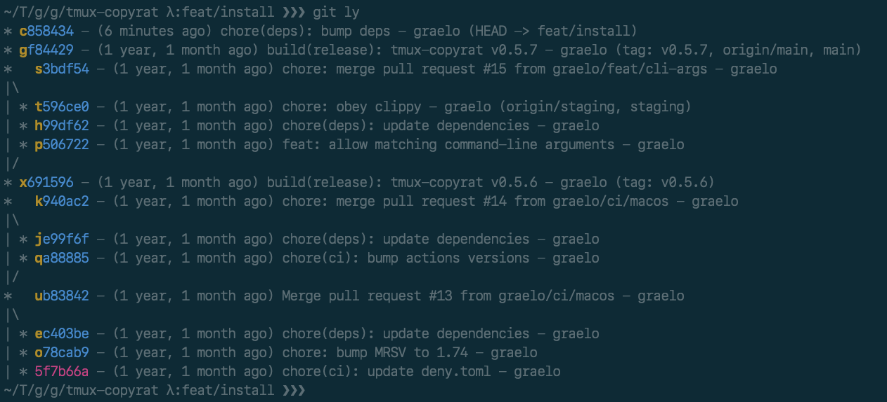
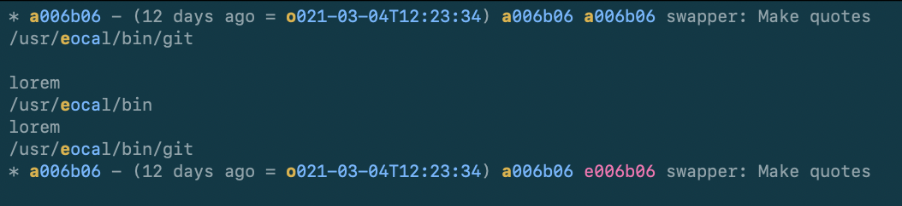

# tmux-copyrat

[](https://github.com/graelo/tmux-copyrat/actions)
[](https://rust-lang.github.io/rfcs/2495-min-rust-version.html)
[](https://doc.rust-lang.org/edition-guide/rust-2024/index.html)
[](https://crates.io/crates/copyrat)
[](https://tmux.github.io)

## Name

**tmux-copyrat** — highlight and copy pattern-matched text from tmux panes

## Synopsis

<kbd>prefix</kbd> + <kbd>t</kbd> + <kbd>key</kbd> — search visible area\
<kbd>prefix</kbd> + <kbd>T</kbd> + <kbd>key</kbd> — search entire scrollback

## Description

tmux-copyrat scans the active tmux pane for text matching a named pattern (URLs,
IPs, SHAs, paths, etc.), overlays single/double-character hints on each match,
and copies the selected span to the tmux buffer or system clipboard.

Inspired by [tmux-copycat] and [tmux-thumbs].

## Demo

<kbd>prefix</kbd> + <kbd>t</kbd> + <kbd>h</kbd> highlights SHA hashes with
copyable hints:

](images/tmux-copyrat-hashes.png)

## Default Keys

| Key              | Pattern                                 |
| ---------------- | --------------------------------------- |
| <kbd>a</kbd>     | command-line args                       |
| <kbd>c</kbd>     | hex color codes                         |
| <kbd>d</kbd>     | dates / datetimes                       |
| <kbd>D</kbd>     | Docker/Podman IDs                       |
| <kbd>e</kbd>     | email addresses                         |
| <kbd>G</kbd>     | 4+ digit strings                        |
| <kbd>h</kbd>     | SHA-1/2 hashes                          |
| <kbd>m</kbd>     | markdown URLs                           |
| <kbd>p</kbd>     | file paths                              |
| <kbd>P</kbd>     | pointer addresses                       |
| <kbd>q</kbd>     | quoted strings (single/double/backtick) |
| <kbd>u</kbd>     | URLs                                    |
| <kbd>U</kbd>     | UUIDs                                   |
| <kbd>v</kbd>     | version numbers                         |
| <kbd>4</kbd>     | IPv4 addresses                          |
| <kbd>6</kbd>     | IPv6 addresses                          |
| <kbd>space</kbd> | all patterns                            |
| <kbd>/</kbd>     | custom regex (prompted)                 |

## Runtime Controls

| Key                         | Action                          |
| --------------------------- | ------------------------------- |
| hint chars                  | copy span and exit              |
| <kbd>CAPS</kbd> hint        | copy to system clipboard        |
| <kbd>n</kbd> / <kbd>N</kbd> | next / previous span            |
| <kbd>y</kbd>                | yank focused span (tmux buffer) |
| <kbd>Y</kbd>                | yank focused span (clipboard)   |
| <kbd>Space</kbd>            | toggle output destination       |
| <kbd>Esc</kbd>              | cancel                          |

Multi-select mode adds <kbd>Tab</kbd> (toggle focused span) and <kbd>Enter</kbd>
(confirm selection). See [CONFIGURATION.md].

## Standalone Binary

`copyrat` reads from stdin and writes the selected span to stdout, with no tmux
dependency:

```sh
git log | copyrat -r -u -x sha -x datetime | pbcopy
```

Multi-select is supported via `-m` (and `-S` for separator):

```sh
echo "127.0.0.1 and 192.168.1.1 and hello@world.com" | copyrat -A -m
```

](images/copyrat-output.png)

## See Also

- [INSTALLATION.md] — install via TPM, manual clone, or Homebrew
- [CONFIGURATION.md] — colors, alphabets, custom bindings, multi-select
- [CONTRIBUTING.md] — development setup, code coverage

## License

Licensed under either of:

- Apache License, Version 2.0 ([LICENSE-APACHE](LICENSE-APACHE) or
  <https://www.apache.org/licenses/LICENSE-2.0>)
- MIT license ([LICENSE-MIT](LICENSE-MIT) or
  <https://opensource.org/licenses/MIT>)

at your option.

### Contribution

Unless you explicitly state otherwise, any contribution intentionally
submitted for inclusion in the work by you, as defined in the Apache-2.0
license, shall be dual licensed as above, without any additional terms or
conditions.

[tmux-copycat]: https://github.com/tmux-plugins/tmux-copycat
[tmux-thumbs]: https://crates.io/crates/tmux-thumbs
[INSTALLATION.md]: INSTALLATION.md
[CONFIGURATION.md]: CONFIGURATION.md
[CONTRIBUTING.md]: CONTRIBUTING.md
