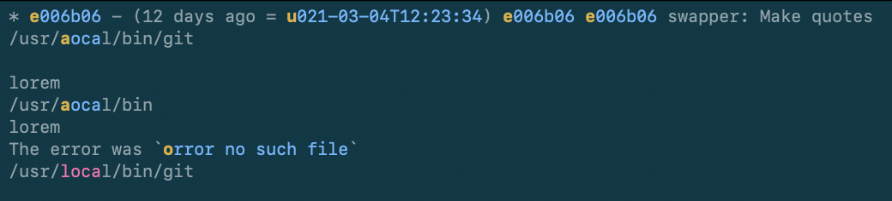

# tmux-copyrat

[](https://crates.io/crates/tmux-copyrat)
[](https://docs.rs/tmux-copyrat)
[](https://rust-lang.github.io/rfcs/2495-min-rust-version.html)
[](https://doc.rust-lang.org/edition-guide/rust-2021/index.html)
[](https://tmux.github.io)
[](https://github.com/graelo/tmux-copyrat/actions)

A tmux-plugin for copy-pasting spans of text from the [tmux] pane's history
into a clipboard.

**Use case**: you're in tmux and press the key binding to highlight, say dates.
This makes `tmux-copyrat` search within tmux's current pane history and
highlight all spans of text which correspond to a date. All spans are displayed
with a one or two key _hint_, which you can then press to copy-paste the span
into the tmux clipboard or the system clipboard. Check out the demo below.

The name is a tribute to [tmux-copyrat], which I used for many years for that
same functionality. For this Rust implementation, I got inspired by
[tmux-thumbs], and I even borrowed some parts of his regex tests.


## Demo

[](https://asciinema.org/a/232775?autoplay=1)


## Usage

First install and optionally customize the plugin (see both [INSTALLATION.md]
and [CONFIGURATION.md] pages) and restart tmux.

Press one of the pre-defined tmux key-bindings (see table below) in order to
highlight spans of text matching a specific pattern. To yank some text span in
the tmux buffer, press the corresponding _hint_, or press <kbd>Esc</kbd> to
cancel and exit.

If instead you want to yank the text span into the system clipboard, either
press the caps version of the key hint (for instance <kbd>E</kbd> instead of
<kbd>e</kbd>), or first toggle the destination buffer with the <kbd>space</kbd>
key and press the hint with no caps.

You can also use the <kbd>n</kbd> and <kbd>N</kbd> (or <kbd>Up</kbd> and
<kbd>Down</kbd>) keys to move focus across the highlighted spans. Press
<kbd>y</kbd> to yank the focused span into the tmux buffer, or press
<kbd>Y</kbd> to yank it into the system clipboard.

By default, span highlighting starts from the bottom of the terminal, but you
can reverse that behavior with the `--reverse` option. The
`--focus-wrap-around` option makes navigation go back to the first span. Many
more options are described in [CONFIGURATION.md].


### Matched patterns and default key-bindings

tmux-copyrat can match one or more pre-defined (named) patterns, but you can
add your own too (see [CONFIGURATION.md]).

The default configuration provided in the [`copyrat.tmux`](copyrat.tmux) plugin
file provides the following key-bindings. Because they all start with
<kbd>prefix</kbd> + <kbd>t</kbd>, the table below only lists the keyboard key
that comes after. For instance, for URLs, the key is <kbd>u</kbd>, but you
should type <kbd>prefix</kbd> + <kbd>t</kbd> + <kbd>u</kbd>.

| key binding      | searches for                           | pattern name      |
| ---              | ---                                    | ---               |
| <kbd>c</kbd>     | Hex color codes                        | `hexcolor`        |
| <kbd>d</kbd>     | Dates or datetimes                     | `datetime`        |
| <kbd>D</kbd>     | Docker/Podman IDs                      | `docker`          |
| <kbd>e</kbd>     | Emails                                 | `email`           |
| <kbd>G</kbd>     | String of 4+ digits                    | `digits`          |
| <kbd>h</kbd>     | SHA-1/-2 short & long                  | `sha`             |
| <kbd>m</kbd>     | Markdown URLs `[..](matched-url)`      | `markdown-url`    |
| <kbd>p</kbd>     | Abs. and rel. filepaths                | `path`            |
| <kbd>P</kbd>     | Hex numbers and pointer addresses      | `pointer-address` |
|                  | strings inside single quotes           | `quoted-single`   |
|                  | strings inside double quotes           | `quoted-double`   |
|                  | strings inside backticks               | `quoted-backtick` |
| <kbd>q</kbd>     | strings inside single/double/backticks |                   |
| <kbd>u</kbd>     | URLs                                   | `url`             |
| <kbd>U</kbd>     | UUIDs                                  | `uuid`            |
| <kbd>v</kbd>     | version numbers                        | `version`         |
| <kbd>4</kbd>     | IPv4 addresses                         | `4`               |
| <kbd>6</kbd>     | IPv6 addresses                         | `6`               |
| <kbd>space</kbd> | All patterns                           |                   |


## Tmux compatibility

`tmux-copyrat` is known to be compatible with tmux 3.0 onwards.

Testing this kind of integration with tmux is time consuming, so I'll be
grateful if you report incompatibilities as you find them.


## The `copyrat` standalone executable

Although the central binary of this crate is `tmux-copyrat`, the crate also
ships with the `copyrat` executable which provides the same functionality,
minus any tmux dependency or integration and instead reads from stdin.

You can use `copyrat` to search a span of text that you provide to stdin, à la
[FZF] but more focused and less interactive.

For instance here is a bunch of text, with dates and git hashes which you can
search with copyrat.

```text
* e006b06 - (12 days ago = 2021-03-04T12:23:34) e006b06 e006b06 swapper: Make quotes
/usr/local/bin/git

lorem
/usr/local/bin
lorem
The error was `Error no such file`
```

Let's imagine you want a quick way to always search for SHA-1/2, datetimes, strings within backticks, you would define once the following alias

```zsh
$ alias pick='copyrat -r --unique-hint -s bold -x sha -x datetime -x quoted-backtick | pbcopy'
```

and simply

```console
$ git log | pick
```

You will see the following in your terminal

](images/copyrat-output.png)

You may have noticed that all identical spans share the same _hint_, this is
due to the `-unique-hint` option (`-u`). The hints are in bold text, due to the
`--hint-style bold` option (`-s`). Hints start from the bottom, due to the
`--reverse` option (`-r`). A custom pattern was provided for matching any
"loca", due to the `--custom-regex-pattern` option (`-X`). The sha, datetime
and content inside backticks were highlighted due to the `--named-pattern`
option (`-x`).


## Standalone `thumbs`

This project started as a `tmux` plugin but after reviewing it with some
friends we decided to explore all the possibilities of decoupling thumbs from
`tmux`. You can install it with a simple command:

```
cargo install thumbs
```

And those are all available options:

```
thumbs 0.4.1
A lightning fast version copy/pasting like vimium/vimperator

USAGE:
    thumbs [FLAGS] [OPTIONS]

FLAGS:
    -c, --contrast    Put square brackets around hint for visibility
    -h, --help        Prints help information
    -m, --multi       Enable multi-selection
    -r, --reverse     Reverse the order for assigned hints
    -u, --unique      Don't show duplicated hints for the same span
    -V, --version     Prints version information

OPTIONS:
    -a, --alphabet <alphabet>                          Sets the alphabet [default: qwerty]
        --bg-color <background_color>                  Sets the background color for spans [default: black]
        --fg-color <foreground_color>                  Sets the foregroud color for spans [default: green]
    -f, --format <format>
            Specifies the out format for the picked hint. (%U: Upcase, %H: Hint) [default: %H]

        --hint-bg-color <hint_background_color>        Sets the background color for hints [default: black]
        --hint-fg-color <hint_foreground_color>        Sets the foregroud color for hints [default: yellow]
    -p, --position <position>                          Hint position [default: left]
    -x, --regexp <regexp>...                           Use this regexp as extra pattern to match
        --select-bg-color <select_background_color>    Sets the background color for selection [default: black]
        --select-fg-color <select_foreground_color>    Sets the foreground color for selection [default: blue]
    -t, --target <target>                              Stores the hint in the specified path
```


If you want to enjoy terminal hints, you can do things like this without `tmux`:

```
> alias pick='thumbs -u -r | xsel --clipboard -i'
> git log | pick
```


## Run code-coverage

Install the llvm-tools-preview component and grcov

```sh
rustup component add llvm-tools-preview
cargo install grcov
```

Install nightly

```sh
rustup toolchain install nightly
```

The following make invocation will switch to nigthly run the tests using
Cargo, and output coverage HTML report in `./coverage/`

```sh
make coverage
```

The coverage report is located in `./coverage/index.html`


## License

This project is licensed under the [MIT license]

at your option.


### Contribution

Unless you explicitly state otherwise, any contribution intentionally submitted
for inclusion in the work by you, as defined in the MIT license, shall
be licensed as MIT, without any additional terms or conditions.

[tmux]: https://tmux.github.io
[tmux-copyrat]: https://github.com/tmux-plugins/tmux-copycat
[CONFIGURATION.md]: CONFIGURATION.md
[INSTALLATION.md]: INSTALLATION.md
[tmux-thumbs]: https://crates.io/crates/tmux-thumbs
[FZF]: https://github.com/junegunn/fzf
[xsel]: https://ostechnix.com/access-clipboard-contents-using-xclip-and-xsel-in-linux/
[MIT license]: http://opensource.org/licenses/MIT
